<div align="center">

# Отчет

## Практическая работа №3

## Обработка событий клика

</div>

**Выполнил:**
Тушканов Виктор Алексеевич

**Курс:** 2

**Группа:** ИНС-б-о-24-1

**Направление:** 09.03.02 «Информационные системы и технологии»

**Профиль:** «Прикладное программирование в интеллектуальных информационных системах»

---

### Цель работы

Изучить механизм обработки событий в Android. Научиться обрабатывать нажатия на элементы интерфейса (кнопки) с помощью декларативного подхода (XML) и программного подхода (Java). Освоить работу с идентификаторами ресурсов и Toast-уведомлениями.

### Ход работы

**Задание 1: Создание проекта и верстка экрана**

Открыл Android Studio и создал новый проект с шаблоном Empty Views Activity.

<div align="center">

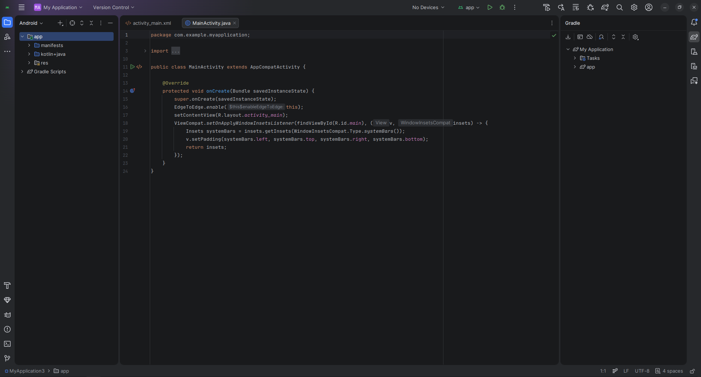
*Рисунок 1. Создание проекта.*

</div>

Открыл файл activity_main.xml. Корневым элементом сделал LinearLayout. Добавил вертикальную ориентацию.

<div align="center">

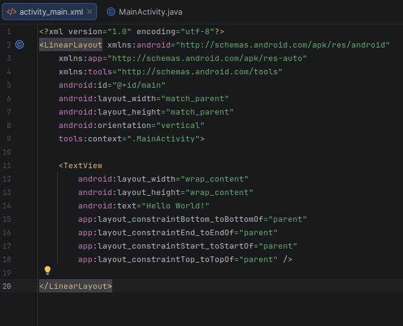

*Рисунок 2. Настройка activity_main.*

</div>

Добавил под стандартным TextView кнопку.

<div align="center">

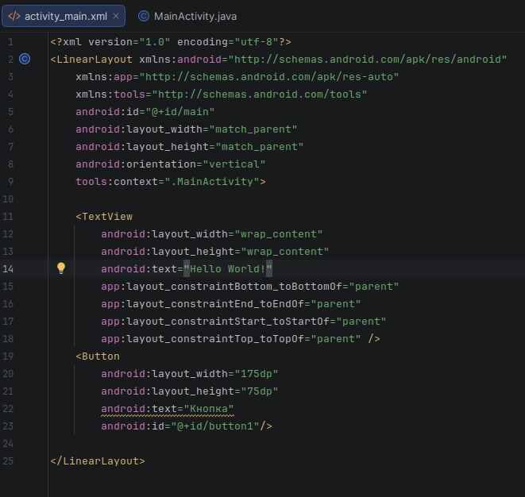

*Рисунок 3. Добавление кнопки.*

</div>

**Задание 2: Обработка клика через XML-атрибут onClick (Декларативный подход)**

В файле activity_main.xml добавил к кнопке атрибут onClick:

<div align="center">

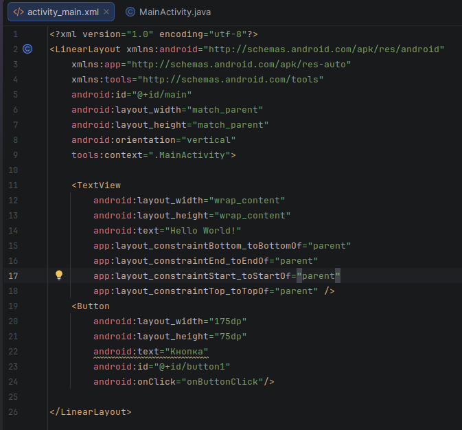

*Рисунок 4. Добавление атрибута onClick.*

</div>

Открыл файл MainActivity.java. Создал метод с именем onButtonClick, который соответствует сигнатуре, требуемой для обработчика кликов. Добавил внутрь метода показ всплывающего сообщения (Toast).

<div align="center">

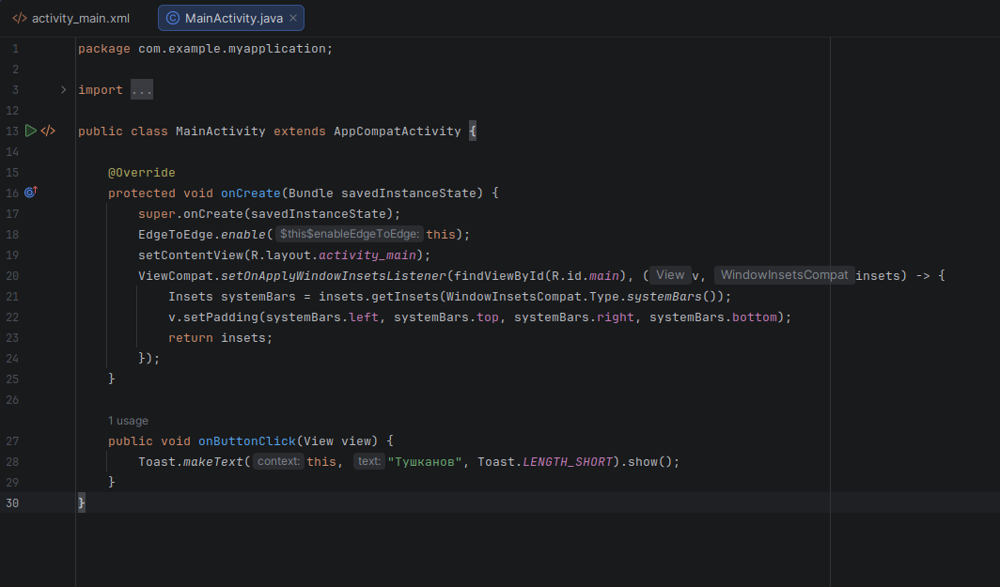
*Рисунок 5. Создание метода onButtonClick.*

</div>

Запустил приложение. При нажатии на кнопку появляется всплывающее сообщение.

<div align="center">

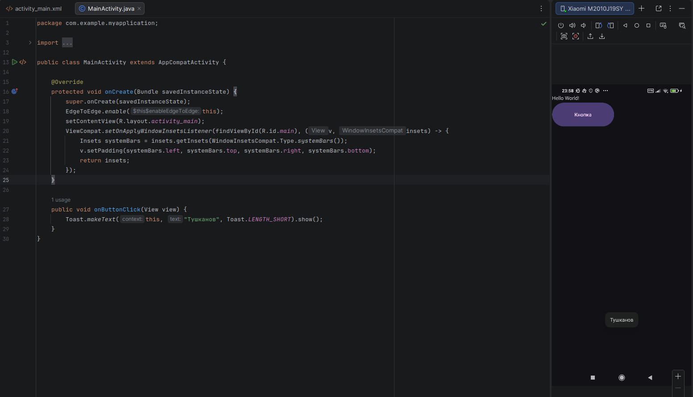
*Рисунок 6. Запуск приложения.*

</div>

**Задание 3: Обработка клика через setOnClickListener (Программный подход)**

Удалил атрибут android:onClick из XML-разметки кнопки. Теперь обработчик будет назначаться в коде. В методе onCreate файла MainActivity.java получил ссылку на кнопку по её идентификатору и установил слушателя событий.

<div align="center">

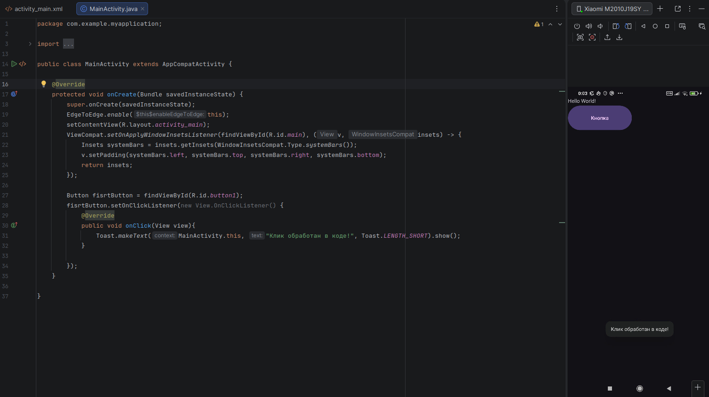
*Рисунок 7. Назначение обработчика в коде.*

</div>

**Задание 4: Использование аргумента View для изменения нажатой кнопки**

Модифицировал код из Задания 3. Внутри метода onClick изменил текст самой нажатой кнопки.

<div align="center">

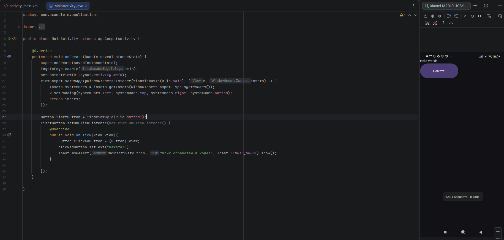
*Рисунок 8. Изменение текста кнопки при нажатии.*

</div>

**Задание 5: Работа с несколькими кнопками**

Добавил в activity_main.xml еще две кнопки. Присвоил им уникальные id: @+id/button2 и @+id/button3.

<div align="center">

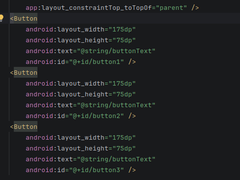

*Рисунок 9. Добавление кнопок.*

</div>

В методе onCreate получил ссылки на все три кнопки и назначил один слушатель на всех, но с проверкой v.getId().

<div align="center">

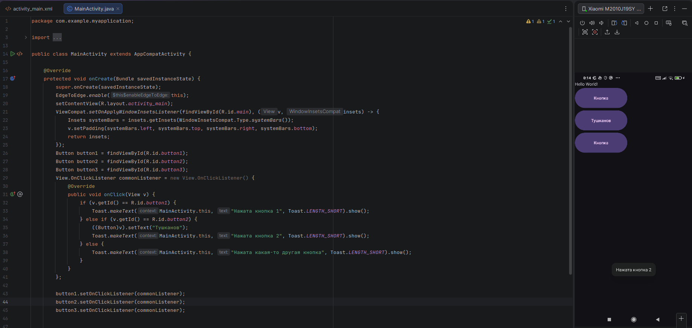
*Рисунок 10. Добавление событий на все кнопки.*

</div>

**Задания для самостоятельного выполнения**

**1. Фамилия при клике.**
Модифицировал приложение из Задания 2 так, чтобы при нажатии на кнопку на экране отображалась фамилия и инициалы.

<div align="center">

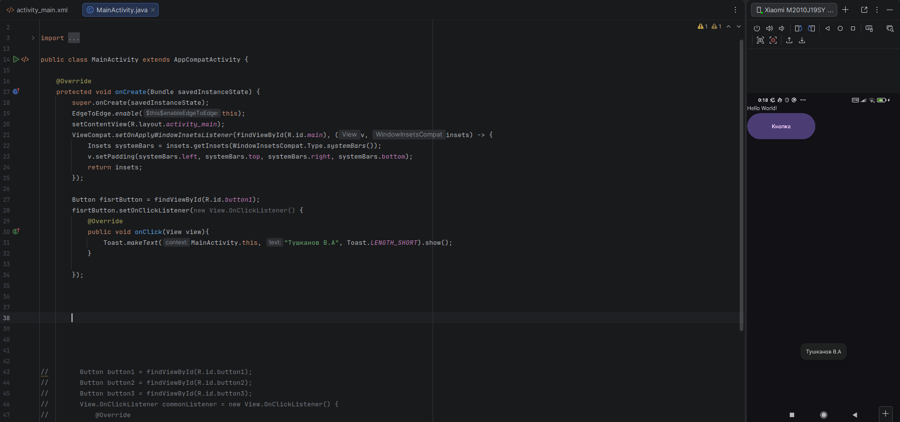
*Рисунок 11. Отображение при клике.*

</div>

**2. Изменение текста кнопки.**
Добавил вторую кнопку. При нажатии на эту кнопку текст на ней менялся на фамилию.

<div align="center">

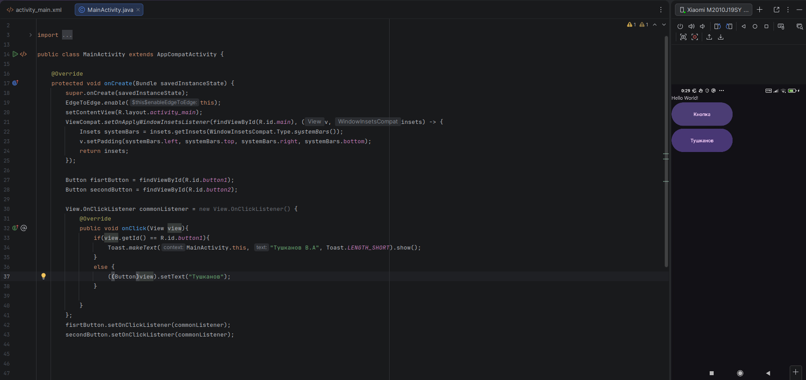
*Рисунок 12. Изменение текста кнопки при клике.*

</div>

**3. Три кнопки и три события.**
Создал три кнопки. Реализовал логику, где для каждой кнопки назначен свой отдельный слушатель. При нажатии на любую из кнопок Toast выводит фамилию, но с указанием, какая именно кнопка была нажата.

<div align="center">

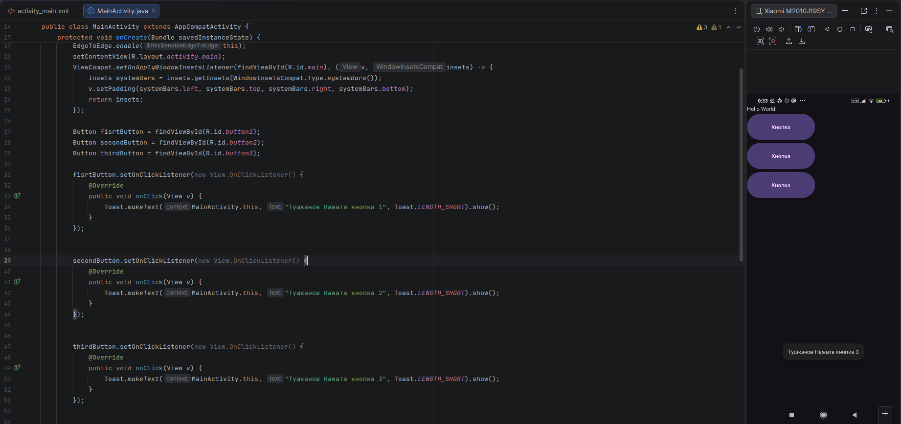
*Рисунок 13. Три кнопки с отдельными слушателями.*

</div>

**4. Три кнопки и один слушатель.**
Выполнил задание 3, используя один общий объект-слушатель и проверяя v.getId() для идентификации нажатой кнопки.

<div align="center">

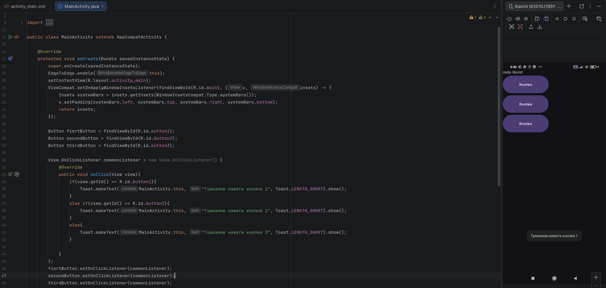
*Рисунок 14. Три кнопки с одним слушателем.*

</div>

**5. Переключение реакции.**
Создал новое приложение с двумя кнопками. Реализовал логику, при которой нажатие на первую кнопку включает «режим А» (показывается Toast с фамилией), а нажатие на вторую кнопку переключает в «режим Б» (при нажатии на первую кнопку Toast показывает, например, номер группы). Для этого использовал переменную-флаг.

<div align="center">

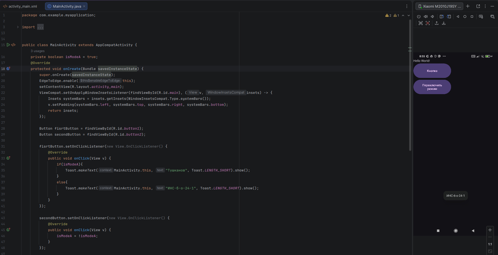
*Рисунок 15. Приложение с двумя кнопками и режимами.*

</div>

### Вывод

В ходе выполнения практической работы были изучены основные способы обработки событий клика в Android: декларативный (через атрибут onClick в XML) и программный (с помощью setOnClickListener). Освоены методы взаимодействия с элементами интерфейса, включая изменение состояния кнопок и вывод всплывающих уведомлений Toast. Полученные навыки позволяют создавать интерактивные приложения с гибкой логикой обработки пользовательских действий.

### Ответы на контрольные вопросы

**1. ViewBinding и его преимущества**

ViewBinding — это механизм, генерирующий класс привязки для каждого XML-файла, который содержит прямые ссылки на все View с идентификаторами.

Преимущества перед findViewById():

- **Типобезопасность** — не требуется приведение типов, все поля имеют корректный тип.
- **Null-безопасность** — ссылки корректно типизированы, исключая ошибки с неправильным ID.
- **Производительность** — поиск View выполняется один раз при создании binding.

Подключение: в build.gradle модуля добавить `android { buildFeatures { viewBinding true } }`.

В Activity:

```java
ActivityMainBinding binding = ActivityMainBinding.inflate(getLayoutInflater());
setContentView(binding.getRoot());
binding.buttonAction.setOnClickListener(...); // доступ напрямую
```

**2. Декларативная или программная подписка**

Декларативная (`android:onClick="method"` в XML):

- Обработчик задаётся именем метода в Activity (сигнатура `public void method(View v)`).
- Минусы: жёсткая привязка к Activity, использование рефлексии, сложность отладки.
- Подходит для очень простых экранов или быстрого прототипирования.

Программная (`setOnClickListener(...)` в Java/Kotlin):

- Обработчик устанавливается динамически (анонимный класс, лямбда, ссылка на метод).
- Плюсы: гибкость, лучшая читаемость, легко тестировать, нет рефлексии.
- Предпочтительнее в большинстве случаев, особенно в архитектурных паттернах (MVVM, MVP).

**3. Изменение сигнатуры метода в XML-обработчике**

Если изменить сигнатуру (например, убрать параметр `View v`), то при нажатии на кнопку возникнет `IllegalStateException` (или `NoSuchMethodException`). Причина: система ищет метод с точно определённой сигнатурой `void methodName(View)`; если метод отсутствует, возникает исключение. Контракт должен строго соблюдаться.

**4. Жизненный цикл Activity и инициализация слушателей**

Основные методы (в порядке выполнения):

- `onCreate()` — создание Activity, разметка загружена, вызывается один раз.
- `onStart()` — Activity становится видимой.
- `onResume()` — Activity получает фокус ввода.

Лучшее место для установки слушателей — `onCreate()`, так как View уже созданы после вызова `setContentView()`. Метод вызывается единожды, что эффективно (не нужно переустанавливать обработчики при возврате из фона). Инициализация в `onStart()` или `onResume()` привела бы к повторной установке при каждом возобновлении, что избыточно.

**5. Анонимный внутренний класс**

Анонимный внутренний класс — это класс без имени, объявляемый и создаваемый одновременно. Он используется для реализации интерфейсов или расширения классов «на лету». При установке слушателей событий в Java создаётся анонимный класс, реализующий интерфейс `View.OnClickListener`. Такой подход удобен, когда обработчик нужен только в одном месте и его логика проста.
